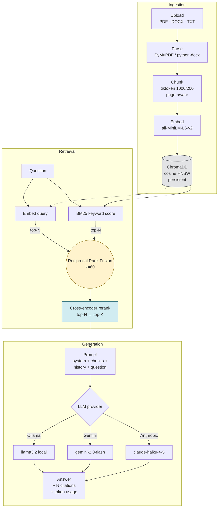

# RAG Document Intelligence System

[](https://github.com/Sathvik2311/DocumentIntelligenceSystem/actions/workflows/ci.yml)
[](https://www.python.org/)
[](#license)

A production-style Retrieval-Augmented Generation web app: upload PDFs / DOCX / TXT, ask questions in natural language, get grounded answers with chunk-level citations.

## Highlights

- 🔀 **Pluggable LLM provider** — local Ollama (default), Google Gemini, or Anthropic Claude. Switch with one `.env` change.
- 🎯 **Modern retrieval pipeline** — dense (cosine) + sparse (BM25) fused via Reciprocal Rank Fusion, then cross-encoder reranked. Each stage independently toggleable per request.
- 📚 **Multi-document scoped chat** — checkbox-pick any subset of your corpus; per-scope conversation history with multi-turn follow-ups.
- 📎 **Always-cited answers** — every response shows `[N]` markers tied to the exact filename / page / chunk / similarity score that grounded it.
- 📊 **Built-in eval harness** — golden Q&A pairs, Hit@k / MRR, and an LLM-judge faithfulness scorer. `--ablate` flag prints a side-by-side comparison table.
- 🧪 **62 pytest tests** — ingestion, retrieval, generation (mocked LLM), reranker (faked CrossEncoder), and FastAPI router coverage. Runs in ~9 s.
- 🐳 **One-command deploy** — `docker compose up` and you have backend + frontend + persistent corpus.

## Stack

- **Backend** — FastAPI · Pydantic v2 · structured JSON errors
- **Retrieval** — ChromaDB (persistent, cosine HNSW) · sentence-transformers (`all-MiniLM-L6-v2`) · `rank-bm25` · `cross-encoder/ms-marco-MiniLM-L-6-v2`
- **Generation** — pluggable: Ollama (`llama3.2`) · Google Gemini (`gemini-2.0-flash`) · Anthropic Claude (`claude-haiku-4-5`)
- **Frontend** — Streamlit (chat UI with per-doc scoping, inline upload, citation previews, A/B toggles for hybrid + rerank)
- **Tests** — 62 pytest tests + an eval harness with golden Q&A pairs
- **Container** — Docker + docker-compose

## Quickstart (Docker)

```bash
cp .env.example .env
# Edit .env — at minimum, pick LLM_PROVIDER. Ollama is the free default.

docker compose up --build
```

- Backend API → http://localhost:8000  (Swagger UI at `/docs`)
- Streamlit UI → http://localhost:8501

If you're using the default Ollama provider, run `ollama serve` and `ollama pull llama3.2` on the host first; the containers reach it via `host.docker.internal`.

To wipe the corpus and start fresh:
```bash
docker compose down -v
```

## Quickstart (local / no Docker)

```bash
python -m venv .venv && source .venv/bin/activate
pip install -r requirements.txt
cp .env.example .env

# Terminal 1
uvicorn backend.main:app --reload

# Terminal 2
streamlit run frontend/app.py
```

## CLI

```bash
python ingest.py path/to/file.pdf
python query.py "what are the key findings?" --top-k 3
python query.py "..." --retrieval-only          # skip the LLM, dump chunks only
```

## Architecture



Each retrieval stage is independently toggleable via `.env` (`ENABLE_HYBRID_SEARCH`, `ENABLE_RERANKER`) or per-request fields (`use_hybrid`, `use_reranker`) — useful for A/B-comparing modes in the eval harness or the Streamlit sidebar.

<details>
<summary>Plain-text version of the diagram</summary>

```
upload  →  parse (PyMuPDF / python-docx / TXT)
        →  chunk (tiktoken cl100k_base, 1000/200 sliding window, page-aware)
        →  embed (sentence-transformers)
        →  ChromaDB (cosine HNSW, persistent volume)

query   →  embed                 ─┐
        →  BM25 keyword search   ─┴→  Reciprocal Rank Fusion (k=60)
                                              │
                                              ▼
                                  cross-encoder rerank (top-N → top-K)
                                              │
                                              ▼
                                  prompt(system + retrieved + history + question)
                                              │
                                              ▼
                                  LLM provider (Ollama / Gemini / Anthropic)
                                              │
                                              ▼
                                  answer + [N] citations + token usage
```
</details>

## Tests & evals

```bash
pytest tests/ -q                                              # 62 tests, ~9 s
python -m tests.eval.run_eval --ablate                        # cosine vs hybrid vs hybrid+rerank
python -m tests.eval.run_eval --ablate --with-llm             # adds LLM-judge faithfulness
```

The ablation table is the headline output — it lets you measure whether a retrieval change actually helped, not just *feels* better:

```
| mode                | hit@5  | mrr   | faithfulness | n  |
|---------------------|--------|-------|--------------|----|
| cosine              | 0.700  | 0.580 |   0.78       | 30 |
| hybrid              | 0.833  | 0.671 |   0.81       | 30 |
| hybrid + rerank     | 0.933  | 0.812 |   0.86       | 30 |
```

Numbers depend on corpus size and golden-set difficulty; the relative ordering is what matters. With one document and a tiny 10-entry golden set the modes look identical — to see meaningful spread, ingest 5+ diverse documents and grow `golden.jsonl` to 30+ entries (mix factual lookups, semantic paraphrases, exact-keyword cases, and out-of-corpus negatives).

## Project layout

```
backend/
  main.py                    FastAPI app + structured error handlers
  config.py                  pydantic-settings (env-driven config)
  routers/
    documents.py             POST /upload, GET /, DELETE /{id}
    query.py                 POST /query
  services/
    ingestion.py             parse → chunk → embed → persist
    retrieval.py             dense + sparse + RRF + rerank pipeline
    bm25.py                  in-process BM25 index over the Chroma collection
    reranker.py              cross-encoder
    generation.py            provider abstraction (Ollama / Gemini / Anthropic)
  models/schemas.py          Pydantic v2 request/response models
frontend/
  app.py                     Streamlit chat UI
tests/
  test_*.py                  unit + integration coverage (62 cases)
  eval/                      golden Q&A pairs + run_eval.py + LLM judge
ingest.py                    CLI entry — `python ingest.py file.pdf`
query.py                     CLI entry — `python query.py "..."`
Dockerfile                   single image, used by both services
docker-compose.yml           backend + frontend + chroma volume
```

See [CLAUDE.md](CLAUDE.md) for developer commands and conventions.

## Roadmap

- [x] Document ingestion (PDF / DOCX / TXT) with page-aware chunking
- [x] Persistent ChromaDB store with cosine HNSW
- [x] Pluggable LLM provider (Ollama / Gemini / Anthropic)
- [x] FastAPI + Streamlit UI with chat-input upload
- [x] Multi-document scoped chat with conversation memory
- [x] Hybrid retrieval (BM25 + cosine via RRF)
- [x] Cross-encoder reranker
- [x] Eval harness with Hit@k, MRR, LLM-judge faithfulness
- [x] Docker + docker-compose
- [x] GitHub Actions CI (ruff + pytest)
- [x] Streaming answers (SSE, token-by-token)
- [ ] Auto-summary on upload
- [ ] Live demo deployment (Fly.io / EC2)
- [ ] OCR for scanned PDFs
- [ ] Multi-user / shareable corpora

## License

MIT — see [LICENSE](LICENSE).
